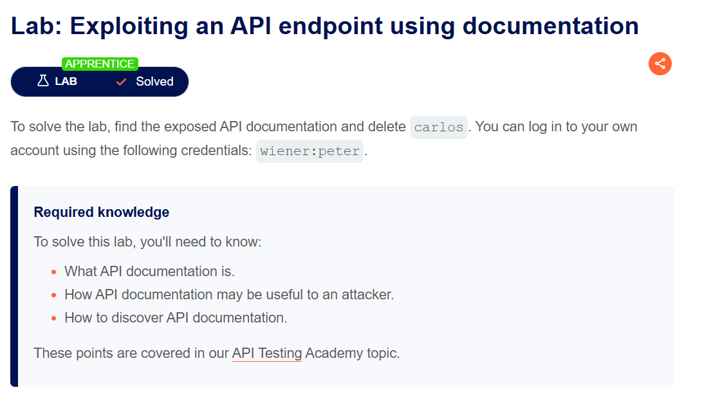
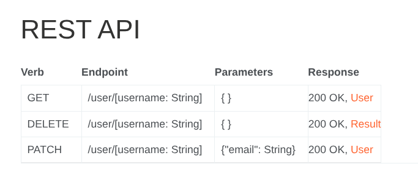
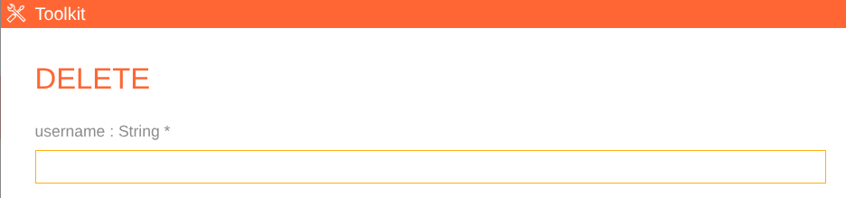

# Lab: Exploiting an API endpoint using documentation

[Open Lab](https://portswigger.net/web-security/api-testing/lab-exploiting-api-endpoint-using-documentation)



## Goal

找到 API documentation，並透過 API 刪除使用者 `carlos`。

## Steps

### Step 1: 進入 Lab 網站

打開 Lab 後，先進入首頁：

```text
https://<LAB-ID>.web-security-academy.net
```

### Step 2: 找到 API documentation

直接造訪 API 文件頁：

```text
https://<LAB-ID>.web-security-academy.net/api
```

在文件中可以看到支援的操作方法，例如 `GET`、`DELETE`、`PATCH`。



### Step 3: 使用 DELETE 刪除 `carlos`

點選 **DELETE**，會跳出測試用的 toolkit。工具會提示需要填入參數：

```text
username: string *
```

在 `username` 欄位輸入：

```text
carlos
```

送出後，即可成功刪除該使用者。



## Result

成功刪除 `carlos`，完成 lab。
